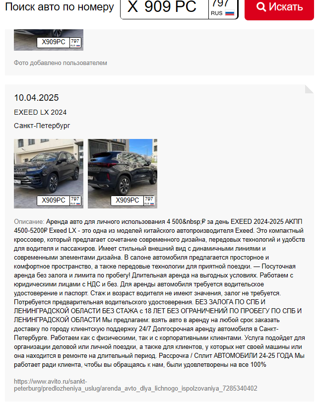

# Неизвестный автомобиль

## Название задачи: Неизвестный автомобиль  
Сложность: Лёгкая  
URL: https://hackerlab.pro/categories/osint/1ee77240-6af1-4b19-a198-35ea2866b1a3  

---

## Условие

У нас есть фотография автомобиля марки EXEED с российским госномером, также есть набор цифр 246398562, который может быть фрагментом VIN, фрагментом телефонного номера, кодом из сервисного документа или случайной последовательностью. Задача — найти имя и фамилию человека, связанного с фото и набором цифр.

Формат флага: CODEBY{Name_Surname}

---

## Исходные данные

дают зипку с изображением. На изображении машина с номером Х909РС797. Марка машины EXEED.

я первый раз сталкиваюсь с бибиками, поэтому хз какие даже тулзы есть...

---

## Ход решения

Через сервис nomerogram.ru удалось выяснить, что автомобиль относится к арендным в Санкт Петербурге.

Там была и ссылка на авито, но ничего я там не нашел и решил подоркать 246398562. 

через дорк site:vk.com 246398562 нашел пост в вк https://vk.com/wall246398562_70

В результате Артем Герасимук и был нашим человеком

---

## Флаг

CODEBY{Artem_Gerasimuk}

---

## Путь решения

По номеру узнаём, что машина находится в аренде. Далее просто пытаемся найти соцсети и понимаем, что цифры являются частью идентификатора VK-ссылки wall246398562_70. Через nomerogram и гугл-дорки задача решается.